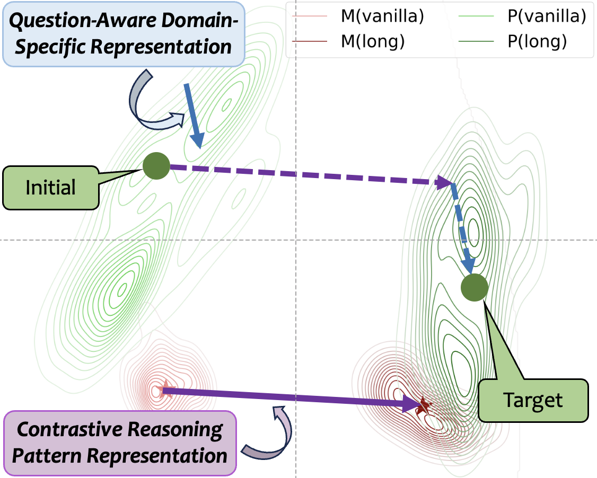
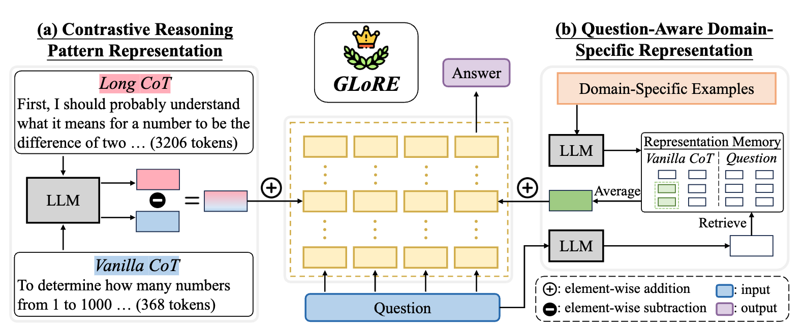
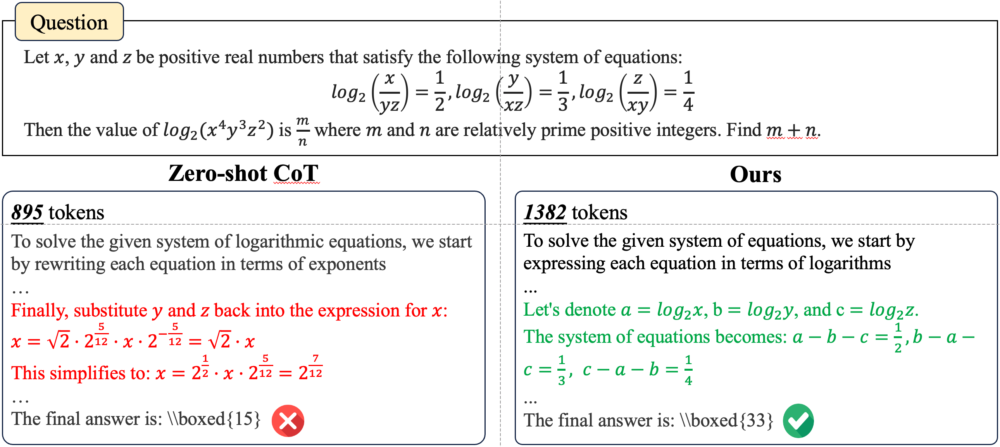

# Unlocking General Long Chain-of-Thought Reasoning Capabilities of Large Language Models via Representation Engineering (ACL 2025)

## 🤩 Contributions 

+ 1️⃣ To the best of our knowledge, we are the first to analyze the mechanism of long CoT reasoning from the perspective of representation.

+ 💡 We propose a novel training-free method **GLoRE** based on representation engineering, which can effectively unlock the general long CoT reasoning capabilities of LLMs.

+ 🔝 Extensive experiments demonstrate the effectiveness and efficiency of our proposed method in both in-domain and cross-domain scenarios.

## 🌟 Highlights 

<div align="center">
  <br>
  <h6 style="text-align: center;">Figure 1: The illustration of how GLoRE unlocks the general long CoT reasoning capabilities through representation engineering in the parameter space.</h6>
</div>

For a specific problem, we first employ a contrastive reasoning pattern to transition the model from the vanilla CoT area to the long CoT area. Then, we inject domain-specific representations to steer the model toward the precision space tailored for this problem. Here, "M" and "P" denote math and physics, respectively.


<div align="center">
  <br>
  <h6 style="text-align: center;">Figure 2: The overview of our approach GLoRE.</h6>
</div>


It extracts contrastive reasoning pattern representations (part a) and question-aware domain-specific representations (part b) and injects them into LLMs. For part a, we derive the representations from the difference between long and vanilla CoTs. For part b, we construct a domain-specific representation memory from vanilla CoTs only and retrieve representations relevant to the question.

<div align="center">
  <br>
  <h6 style="text-align: center;">Figure 3: A specific example of how our method activates the long CoT reasoning capabilities of LLMs.</h6>
</div>

## 🚀 Quick Start

### Requirements

- python == 3.10.14
- pytorch == 2.4.0
- transformers == 4.47.1
- accelerate == 1.2.1


### Download Models

Download models from huggingface, open the utils/utils.py file and update the directory paths in lines 29-34.

### Run

You can get the analysis results by running the following command:

```bash
python analysis/analysis_global_vector.py
python analysis/analysis_domain_vector.py
python analysis/analysis_entropy.py
```

You can get the results of our method by running the following command:

```bash
python method/run_re_2vec.py
```

We use the evaluation framework at [this repository](https://github.com/QwenLM/Qwen2.5-Math)